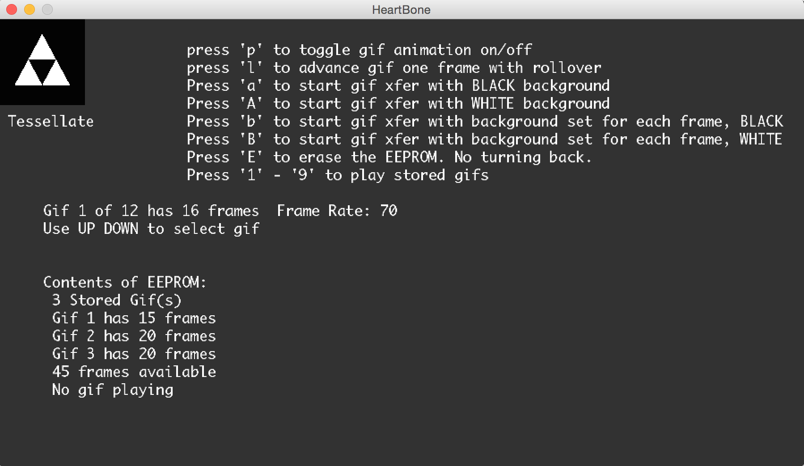

# Heart Bone Cheat Sheet

Now that you've got your Heart Bone connected, you will want to know how to control it. Ok, here we go!

##Buttons

Heart Bone has 4 buttons:

*	play
	*	plays the next stored gif, if available. looping.
*	wake
	*	wake from sleep. return to start screen
*	reset
	*	resets the hardware not useful otherwise
*	sleep
	*	put Heart Bone into low power mode
	*	screen refreshes every 1.024 seconds
	
The Heart Bone should be awake befrore connecting to any control software.

## Keyboard Commands

When you start the Heart Bone software and connect you will see a window that looks liek this

Almost all of the keyboard commands are shown, but hey, we're still in beta..
The program window contains information about gifs stored on the Heart Bone, and givs stored on the computer. The image on the upper left is of a gif stored on the computer. You can scroll all the gifs stored on the computer by using the UP and DOWN keys. Use the following keys to control the Heart Bone. 

### p
*	Press 'p' to animate the gif in the upper left

### l
*	Press 'l' to advance the gif in the upper left frame by frame (with rollover)

### P
*	Press 'P' to print the current frame to the Processing terminal in 1's and 0's 
	*	This is useful for debugging 

### a or A
*	These keys convert the gif image to BLACK and WHITE, and loads it to your Heart Bone. The program reads the color of the FIRST pixel (upper-left-most pixel)of the FIRST gif and uses that as the background color for ALL of the frames in the gif. Pressing 'a' reads the background as BLACK. Pressing 'A' reads the background as WHITE. This works well with most gifs that have a consistent background color, like KOI.gif. Or ones that have an animation that changes the pixel color at the upper left corner of the screen, like Spiraltorustorso.gif 

### b or B
*	These keys convert the gif image to BLACK and WHITE, and loads it to your Heart Bone. The program reads the color of the first pixel of EVERY gif frame (upper-left-most pixel) and uses that as the background color FOR THAT FRAME.This is useful if you have a gif with changing background like explode.gif or fiercingHeart.gif

### E
*	press E to erase all of the stored gifs on your Heart Bone. Heart Bone has room for up to 100 gif frames. They can be divided into up to 9 gifs (this is arbitrary and can change). If you try to load a gif with more frames than are available, you will get an error message in the Sketch window. 