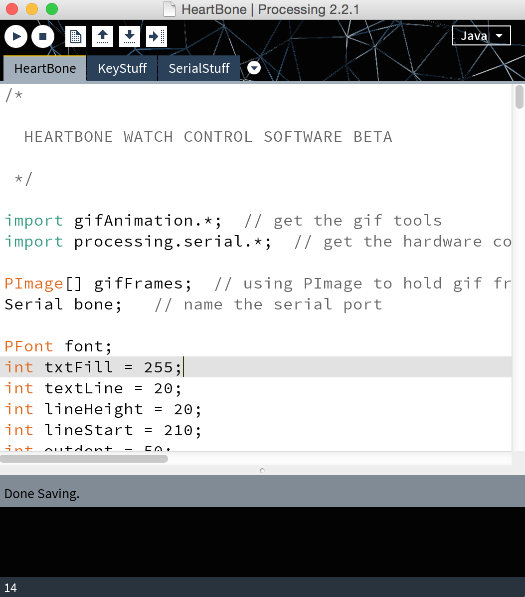

#READ ME

So, you found a Heart Bone...

The enclosed softawre connects with your Hear Bone via USB cable, and allows you to control the Heart Bone's functional capability. This document covers the installation of necessary software, and how to connect to and control the Heart Bone. Let's get started!

## Install Software

### FTDI Driver 

You need a Future Technology Devices (FTDI) driver on your computer if you don't already have one. This tool allows your computer to talk to the Heart Bone through a Virtual COM Port (VCP). Use [this](http://www.ftdichip.com/Drivers/VCP.htm) link the find the correct driver for your operating system, and install it now. It will take n minutes.

### Processing

Processing is a popular creative coding platform. The software that controls your Heart Bone runs a a Sketch in Processing. If you don't already have Processing on your computer, download it [here](https://processing.org/download/). It should take n minutes to download and install Processing.

### Heart Bone Software

The enclosed folder called HeartBone contains a Processing sketch and the current release of gifs engineered to run on the Heart Bone platform. Move the folder and it's entire contents to the location

		User/Documents/Processing

If the Processing folder has not been made yet, go ahead and make it.

##Connect To Your Heart Bone
Start the Processing application, and open the Heart Bone program by clicking on 

		File->Sketchbook->HeartBone
		
It will open a window that looks like this

 