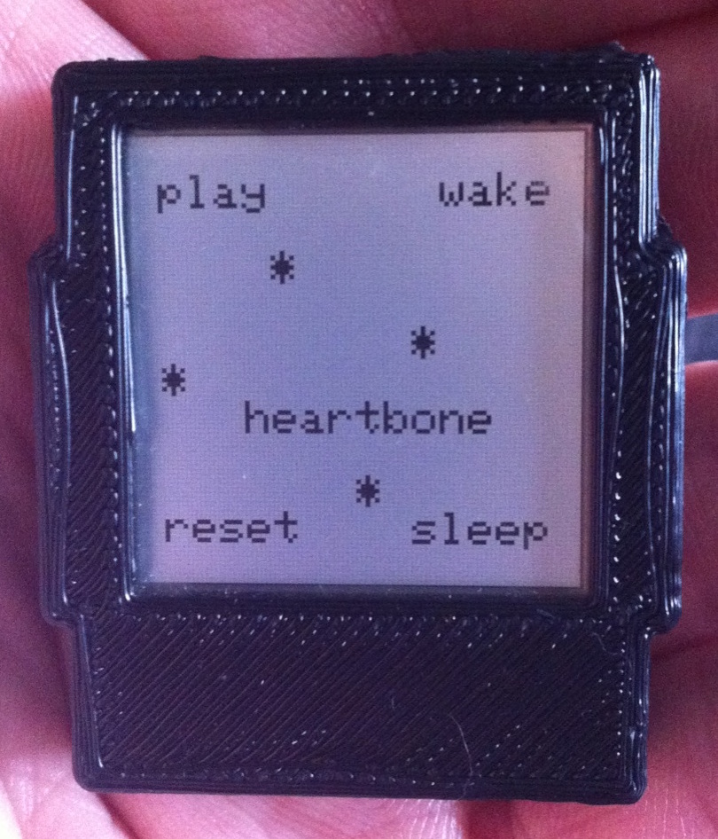
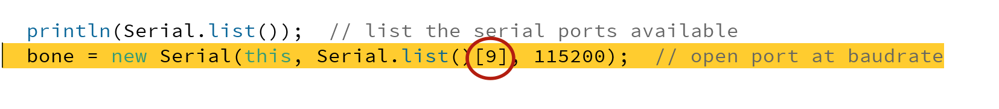

#READ ME

So, you found a Heart Bone...

The enclosed softawre connects with your Hear Bone via USB cable, and allows you to control the Heart Bone's functional capability. This document covers the installation of necessary software, and how to connect to and control the Heart Bone. Let's get started!

## Install Software

### FTDI Driver 

You need a Future Technology Devices International (FTDI) driver on your computer if you don't already have one. This tool allows your computer to talk to the Heart Bone through a Virtual COM Port (VCP). Use [this](http://www.ftdichip.com/Drivers/VCP.htm) link the find the correct driver for your operating system, and install it now. It will take n minutes.

### Processing

Processing is a popular creative coding platform. The software that controls your Heart Bone runs a a Sketch in Processing. If you don't already have Processing on your computer, download it [here](https://processing.org/download/). It should take n minutes to download and install Processing.

### Heart Bone Software

First, download the contents of this repository by clicking the "Download Zip" button on the right, or click [here](https://github.com/biomurph/HeartBone/archive/master.zip). The enclosed folder called HeartBone contains a Processing sketch and the current release of gifs engineered to run on the Heart Bone platform. Move the folder and it's entire contents to the location

		User/Documents/Processing

If the Processing folder has not been made yet, go ahead and make it.

##Connect To Your Heart Bone

There are 4 buttons on your Heart Bone, Refer to this image to find the locations of the buttons.

Start the Processing application, and open the Heart Bone program by clicking on 

		File->Sketchbook->HeartBone
		
It will open a window that looks like this

Plug your Heart Bone into the USB cable. If you see a red LED light up, you know the battery is being charged. **Make Sure The Heart Bone Is Awake** by pressing the wake button. Then, launch the program by pressing the play button in Processing

###Connect to the right Serial Port!

This is where things get tedious, but it's a simple process. When you play the sketch in Processing, one of the first things it does is to try to connect to the Heart Bone. If it can't connect, you will get an error that looks like this

If this happens, take a look at the white on black text at the bottom of the Processing window. There is a list of all available ports on your computer and they all start with **/dev/...** The Heart Bone is among them. Look for the port called

	/dev/tty.usbmodemXXXX
	
The **tty.usbmodem** is the port you want to connect to. Count the ports available starting from 0, and put that number in the highlighted code as shown below

Even if the program starts up, if you may find your Heart Bone unresponsive. If that happens, this is a good place to start debugging. Some ports can pretend to be a Heart Bone.

# Heart Bone Control

Now that you've got your Heart Bone connected, you will want to know how to control it. Ok, here we go!

##Buttons

Heart Bone has 4 buttons:

*	play
	*	plays the next stored gif, if available. looping.
*	wake
	*	wake from sleep. return to start screen
*	reset
	*	resets the hardware not useful otherwise
*	sleep
	*	put Heart Bone into low power mode
	*	screen refreshes every 1.024 seconds
	
The Heart Bone should be awake befrore connecting to any control software.

## Keyboard Commands

When you start the Heart Bone software and connect you will see a window that looks like this

The program window contains information about gifs stored on the Heart Bone, and givs stored on the computer. The image on the upper left is of a gif stored on the computer. You can scroll all the gifs stored on the computer by using the UP and DOWN keys. Use the following keys to control the Heart Bone. 

### p
*	Press 'p' to animate the gif in the upper left

### l
*	Press 'l' to advance the gif in the upper left frame by frame (with rollover)

### P
*	Press 'P' to print the current frame to the Processing terminal in 1's and 0's 
	*	This is useful for debugging 

### a or A
*	These keys convert the gif image to BLACK and WHITE, and loads it to your Heart Bone. The program reads the color of the FIRST pixel (upper-left-most pixel)of the FIRST gif and uses that as the background color for ALL of the frames in the gif. Pressing 'a' reads the background as BLACK. Pressing 'A' reads the background as WHITE. This works well with most gifs that have a consistent background color, like KOI.gif. Or gifs that have an animation that changes the pixel color at the upper left corner of the screen, like Spiraltorustorso.gif 

**Note:** *If you navigate away from the Sketch window while a gif upload is taking place, the frame being loaded will contain a glitch, and not a pretty or cool glitch. This is on the list of future fixes.*

### b or B
*	These keys convert the gif image to BLACK and WHITE, and loads it to your Heart Bone. The program reads the color of the first pixel of EVERY gif frame (upper-left-most pixel) and uses that as the background color FOR THAT FRAME.This is useful if you have a gif with changing background like explode.gif or fiercingHeart.gif

**Note:** *If you navigate away from the Sketch window while a gif upload is taking place, the frame being loaded will contain a glitch, and not a pretty or cool glitch. This is on the list of future fixes.*

### E
*	press E to erase all of the stored gifs on your Heart Bone. Heart Bone has room for up to 100 gif frames. They can be divided into up to 9 gifs (this is arbitrary and can change). If you try to load a gif with more frames than are available, you will get an error message in the Sketch window. 

#Troubleshooting

When in doubt, reboot. Start everything over from the top. Unplug, and the plug again. Re-read these documents, and then email me if it's really broken.

biomurph at gmial dot com

 
